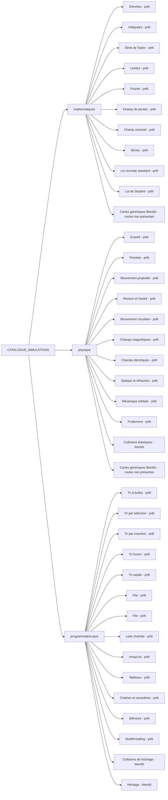
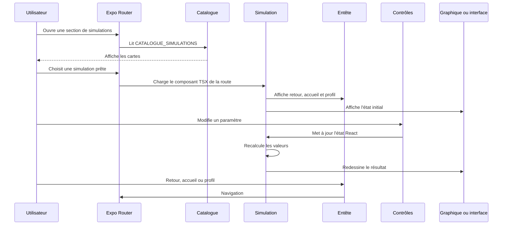
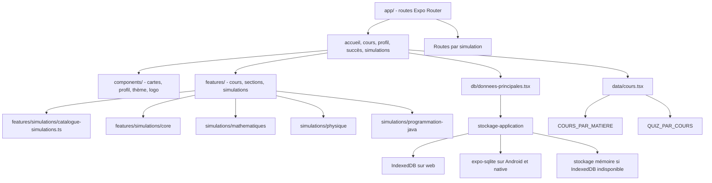

# Evidexe - Application d'apprentissage interactive

Projet final - Programmation  
Tony Khabbaz & Aris Hadjeb

## 1. Introduction

Evidexe est une application éducative interactive faite avec Expo, React Native et TypeScript. L'idée du projet est de rendre certains concepts de mathématiques, de physique et de programmation Java plus faciles à comprendre avec des cours courts, des quiz, des simulations et un suivi de progression.

Le but n'est pas de remplacer un vrai cours. L'application sert plutôt de support pour réviser et expérimenter. Quand une notion est difficile à imaginer seulement avec du texte ou une formule, une simulation peut aider à voir ce qui change quand on modifie les paramètres.

## 2. Problématique

Plusieurs notions vues au cégep deviennent vite abstraites. Par exemple, une dérivée est souvent apprise comme une règle de calcul, mais elle représente aussi une pente instantanée. Une intégrale peut être vue comme une aire accumulée. En physique, les forces, les trajectoires, les champs et l'énergie sont plus clairs quand on peut les visualiser. En Java, les tableaux, les boucles, les structures de données et certains algorithmes sont plus faciles à comprendre quand on voit les étapes.

Evidexe répond à ce problème en regroupant trois choses dans la même application:

- des cours organisés par matière;
- des quiz pour valider la compréhension;
- des simulations pour manipuler les paramètres et observer les résultats.

## 3. Objectifs du projet

Les objectifs principaux étaient:

- créer une application utilisable avec Expo sur web et mobile;
- organiser le contenu en mathématiques, physique et Java;
- offrir des cours courts avec diapositives et quiz;
- ajouter un catalogue de simulations interactives;
- sauvegarder la progression localement;
- gérer un profil avec XP, niveau, cours récents, succès, cartes mémoire et paramètres;
- garder une structure assez claire pour pouvoir ajouter d'autres contenus plus tard.

## 4. Fonctionnalités réalisées

L'application commence par un écran d'introduction, puis arrive sur l'accueil. À partir de là, l'utilisateur peut ouvrir les cours, les simulations, le profil, les succès et les paramètres.

### 4.1 Cours

Les cours sont dans `data/cours.tsx`. Le code actuel contient trois matières et 50 cours au total:

- **Mathématiques**: 20 cours sur les dérivées, les intégrales, les limites, les statistiques, les probabilités et les mathématiques discrètes;
- **Physique**: 15 cours sur les vecteurs, la cinématique, le MRUA, les projectiles, les lois de Newton, l'énergie, la quantité de mouvement, l'électrostatique, les champs, les circuits, les condensateurs, le magnétisme et le courant alternatif;
- **Java**: 15 cours sur les variables, les types, le transtypage, les chaînes, les opérateurs, la classe `Math`, les conditions, les boucles, les tableaux, les méthodes, les classes et la logique booléenne.

Chaque cours contient des diapositives et un quiz final. La progression est enregistrée avec l'utilisateur actif. Un cours atteint vraiment 100 % seulement quand l'exercice final est terminé. Sinon, la dernière diapositive de théorie peut monter jusqu'à 99 %, ce qui évite de compter un cours comme terminé trop tôt.

### 4.2 Simulations

Le catalogue des simulations est dans `features/simulations/catalogue-simulations.ts`. Les simulations réellement prêtes dans le catalogue sont:

- **Mathématiques**: dérivées, intégrales, série de Taylor, limites, Fourier, champ de pentes, champ vectoriel, séries, loi normale standard et loi de Student;
- **Physique**: gravité, pendule, mouvement projectile, ressort et loi de Hooke, mouvement circulaire, champs magnétiques, champs électriques, optique et réfraction, mécanique orbitale et frottement;
- **Java**: tri à bulles, tri par sélection, tri par insertion, tri fusion, tri rapide, pile, file, liste chaînée, ArrayList, tableaux, chaînes et caractères, mémoire et multithreading.

Certaines entrées ne doivent pas être présentées comme terminées. Les collisions élastiques, les collisions de hachage et l'héritage sont marqués comme `bientôt`. Il y a aussi des cartes génériques "Bientôt" générées pour les sections mathématiques et physique. Dans le code, ces cartes génériques ont encore le statut `pret`, mais elles pointent vers des routes absentes. Je les considère donc comme du contenu prévu ou à corriger, pas comme des simulations fonctionnelles.

### 4.3 Profil, progression et paramètres

Le profil permet de voir:

- l'utilisateur actif;
- l'XP et le niveau;
- les cours récents;
- les cours terminés;
- les succès;
- les cartes mémoire;
- la personnalisation du pseudo et de la photo de profil;
- les paramètres visibles dans l'interface, surtout le mode sombre et le compteur FPS.

La couche de données peut gérer plusieurs utilisateurs locaux par nom. Dans l'interface actuelle, on travaille surtout avec l'utilisateur actif, et on peut modifier son pseudo et sa photo. Les données sont sauvegardées localement, pas dans un backend distant.

## 5. Architecture et technologies

Le projet utilise Expo Router pour la navigation. Les routes principales sont dans `app/`. Les composants réutilisables sont dans `components/`. Les écrans et logiques plus spécialisés sont dans `features/`. Les cours sont dans `data/`, et la progression locale est dans `db/`.

Technologies utilisées:

- React Native pour l'interface;
- Expo et Expo Router pour lancer l'application et gérer les routes;
- TypeScript et TSX pour structurer le code;
- React Native SVG pour plusieurs graphiques;
- KaTeX et des composants de rendu de formules pour certaines expressions mathématiques;
- une couche de stockage locale dans `db/donnees-principales.tsx` et `db/stockage-application.ts`;
- Node.js, npm et WebStorm comme outils de développement.

La sauvegarde locale passe par une couche commune appelée `stockage-application`. Sur web, `stockage-application.web.ts` utilise IndexedDB avec un petit magasin clé-valeur. Sur Android et les plateformes natives, `stockage-application.ts` utilise `expo-sqlite` avec une table `kv`. Le code garde aussi un fallback en mémoire seulement quand IndexedDB n'est pas disponible, par exemple dans certains contextes web ou serveur.

## 6. Contenu pédagogique intégré

### 6.1 Mathématiques

La partie mathématiques ne se limite pas seulement aux dérivées, intégrales et limites. Dans les cours, on retrouve aussi des statistiques, des probabilités et des notions de mathématiques discrètes. Les simulations couvrent surtout l'analyse et les statistiques.

Notions présentes:

- fonctions, limites, dérivées et intégrales;
- sommes de Riemann et approximation;
- séries et série de Taylor;
- champs de pentes et champs vectoriels;
- loi normale et loi de Student;
- probabilités, inférence et logique mathématique dans les cours.

### 6.2 Physique

La physique couvre surtout la mécanique et l'électricité. Les cours vont plus loin que seulement cinématique, forces et énergie. Il y a aussi des contenus sur les charges, les champs électriques, les circuits et le magnétisme.

Notions présentes:

- vecteurs, position, vitesse et accélération;
- MRUA, chute libre, projectiles et mouvement circulaire;
- lois de Newton, force nette et frottement;
- travail, énergie, puissance et quantité de mouvement;
- gravité, pendule, ressort et orbites;
- champs électriques, champs magnétiques, optique et circuits.

### 6.3 Programmation Java

Le module Java contient des cours de base et des simulations plus visuelles. Il touche autant la syntaxe que les structures de données.

Notions présentes:

- variables, types, transtypage et opérateurs;
- conditions et boucles;
- tableaux, chaînes, méthodes, classes et objets;
- tris classiques;
- pile, file, liste chaînée et ArrayList;
- mémoire et multithreading;
- collisions de hachage et héritage prévus plus tard.

## 7. Ce que le projet apporte

L'intérêt principal du projet est de mélanger cours, progression et visualisation dans une seule application. Ce n'est pas seulement une liste de textes à lire. L'utilisateur peut aussi ouvrir une simulation, changer des valeurs et voir comment les résultats réagissent.

La séparation entre les cours et les simulations rend aussi le projet plus simple à agrandir. Un nouveau cours peut être ajouté dans `data/cours.tsx`, tandis qu'une nouvelle simulation peut être ajoutée dans `features/simulations/` et reliée au catalogue.

## 8. Difficultés rencontrées

Une difficulté importante a été l'organisation du projet. Comme il y a trois domaines différents, il fallait éviter que les fichiers deviennent mélangés. Les routes, les cours, le profil et les simulations ont donc été séparés.

La progression a aussi demandé plus de logique que prévu. Il ne suffisait pas d'afficher un cours. Il fallait enregistrer le bon utilisateur, garder les cours récents, calculer le pourcentage, donner l'XP une seule fois et ne pas compter un cours comme terminé avant le quiz final.

L'adaptation web/mobile a aussi créé des contraintes. La même logique de progression doit fonctionner avec IndexedDB sur web et SQLite sur Android/native. Il fallait donc créer une couche de stockage commune pour éviter que le reste de l'application dépende directement d'une seule technologie.

Une autre difficulté a été de garder le rapport aligné avec le code. Le catalogue contient beaucoup d'entrées et certaines sont prêtes, alors que d'autres sont seulement prévues. Dans un rapport, c'est facile de trop généraliser. J'ai donc séparé les simulations disponibles des simulations à venir.

## 9. Échéancier détaillé

| Période | Travail prévu | Travail réalisé |
| --- | --- | --- |
| Semaine 1 | Définir le sujet | Choix d'une application éducative sur les maths, la physique et Java |
| Semaine 2 | Créer le projet | Mise en place avec Expo, React Native et TypeScript |
| Semaine 3 | Faire la navigation | Ajout de l'intro, l'accueil, les sections et le profil |
| Semaine 4 | Ajouter les cours | Création des cours, diapositives et quiz dans `data/cours.tsx` |
| Semaine 5 | Gérer la progression | Ajout du profil actif, du support d'utilisateurs locaux, des cours récents, de l'XP, des niveaux et des succès |
| Semaine 6 | Ajouter des simulations de maths | Dérivées, intégrales, limites, Taylor, Fourier, champs, séries et statistiques |
| Semaine 7 | Ajouter des simulations de physique | Gravité, pendule, projectile, ressort, mouvement circulaire, champs, optique, orbites et frottement |
| Semaine 8 | Ajouter les simulations Java | Tris, structures de données, chaînes, mémoire et multithreading |
| Semaine 9 | Stabiliser l'interface | Ajustements visuels, profil, paramètres, responsive et catalogue |
| Semaine 10 | Préparer la remise | Mise à jour du rapport, vérification des diagrammes et distinction entre prêt et bientôt |

## 10. UML et flux de l'application

Les diagrammes suivants sont écrits en Mermaid. Ils représentent la structure actuelle du code, pas seulement une idée générale du projet.

### 10.1 Parcours utilisateur global

```mermaid
flowchart TD
  U[Utilisateur] --> Intro[app/index.tsx - écran d'introduction]
  Intro --> Accueil[/(tabs)/accueil]

  Accueil --> Cours[/(tabs)/cours]
  Accueil --> Simulations[/(tabs)/simulations]
  Accueil --> Profil[/(tabs)/profil]
  Accueil --> Succes[/(tabs)/succes]

  Cours --> ChoixMatiere[Choix d'une matière]
  ChoixMatiere --> CoursMath[Cours mathématiques]
  ChoixMatiere --> CoursPhysique[Cours physique]
  ChoixMatiere --> CoursJava[Cours Java]

  CoursMath --> LectureCours[/(tabs)/cours/sujet/courseId]
  CoursPhysique --> LectureCours
  CoursJava --> LectureCours

  LectureCours --> DiapoSuivante[Diapositive suivante]
  DiapoSuivante --> LectureCours
  LectureCours --> QuizFinal[Quiz final]
  QuizFinal --> Progression[donneesLocales.enregistrerProgressionCours]
  Progression --> Profil

  Simulations --> IndexMath[/(tabs)/mathematiques]
  Simulations --> IndexPhysique[/(tabs)/physique]
  Simulations --> IndexJava[/(tabs)/programmation-java]

  IndexMath --> SimulationMath[Simulation math prête]
  IndexPhysique --> SimulationPhysique[Simulation physique prête]
  IndexJava --> SimulationJava[Simulation Java prête]

  IndexPhysique --> Collisions[Collisions élastiques - bientôt]
  IndexJava --> Hachage[Collisions de hachage - bientôt]
  IndexJava --> Heritage[Héritage - bientôt]

  SimulationMath --> EcranSimulation[Composant de simulation]
  SimulationPhysique --> EcranSimulation
  SimulationJava --> EcranSimulation
  Collisions --> EcranLigne[EcranSimulationLigne]
  Hachage --> EcranLigne
  Heritage --> EcranLigne

  EcranSimulation --> Controles[Sliders, boutons ou champs]
  Controles --> Etats[useState et calculs internes]
  Etats --> Rendu[Graphique SVG ou interface visuelle]
  Rendu --> EcranSimulation

  Profil --> Parametres[Paramètres]
  Profil --> Personnalisation[/(tabs)/profil/personnalisation]
  Profil --> CartesMemoire[Cartes mémoire]
  Profil --> ProgressionProfil[Cours récents et complétions]
  Profil --> Niveau[Niveau et XP]
  Parametres --> ModeSombre[Mode sombre]
  Parametres --> CompteurFPS[Compteur FPS]
  Personnalisation --> PseudoPhoto[Pseudo et photo]
```

### 10.2 Catalogue des simulations



### 10.3 Flux commun d'une simulation



### 10.4 Architecture logique



## 11. Options utilisateur dans les simulations

### 11.1 Simulations mathématiques

| Simulation | Options principales | Résultat |
| --- | --- | --- |
| Dérivées | Choisir une fonction et modifier `x0` | Affiche le point, la tangente, `f(x0)` et `f'(x0)` |
| Intégrales | Choisir une fonction, une méthode et le nombre de rectangles | Compare l'aire approchée, l'aire exacte et l'erreur |
| Série de Taylor | Choisir une fonction et le nombre de termes | Montre l'approximation et l'erreur |
| Limites | Choisir une fonction et la distance d'approche | Affiche les valeurs à gauche et à droite |
| Fourier | Choisir un signal et le nombre d'harmoniques | Affiche l'onde approximée et les phaseurs |
| Champ de pentes | Choisir une équation différentielle et des conditions | Affiche le champ et une courbe solution |
| Champ vectoriel | Choisir un champ et activer les particules | Affiche les vecteurs, la divergence, la rotation et le mouvement |
| Séries | Choisir une série et le nombre de termes | Affiche les termes et les sommes partielles |
| Loi normale standard | Modifier moyenne, écart-type et bornes | Calcule une probabilité sur la courbe normale |
| Loi de Student | Modifier les degrés de liberté et alpha | Affiche la valeur critique et l'intervalle central |

### 11.2 Simulations physiques

| Simulation | Options principales | Résultat |
| --- | --- | --- |
| Gravité | Modifier les masses et la distance | Calcule la force gravitationnelle |
| Pendule | Modifier longueur, gravité, amortissement et angle | Anime le pendule et calcule la période |
| Mouvement projectile | Modifier vitesse, angle et gravité | Affiche la trajectoire et les statistiques |
| Ressort et loi de Hooke | Modifier `k`, masse, amplitude et amortissement | Affiche l'oscillation et la phase |
| Mouvement circulaire | Modifier rayon, vitesse angulaire et masse | Calcule vitesse, période, accélération et force centripète |
| Champs magnétiques | Modifier le nombre de fils, le courant, l'affichage du champ et le point d'observation | Affiche vecteurs, lignes de champ et intensité |
| Champs électriques | Choisir une configuration de charges | Affiche le champ résultant et les lignes |
| Optique et réfraction | Modifier indices et angle incident | Calcule réflexion, réfraction et angle critique |
| Mécanique orbitale | Modifier masse de l'astre, excentricité, orientation et vitesse orbitale | Affiche orbite, périhélie, aphélie et statistiques orbitales |
| Frottement | Modifier masse, force appliquée et coefficients de frottement | Calcule force nette, état du bloc et accélération |

### 11.3 Simulations Java

| Simulation | Options principales | Résultat |
| --- | --- | --- |
| Tris | Mélanger un tableau et avancer étape par étape | Visualise comparaisons, échanges, pivots ou fusions |
| Pile | Utiliser `push`, `pop` et `peek` | Montre le sommet et le principe LIFO |
| File | Utiliser `offer`, `poll` et `peek` | Montre l'avant, l'arrière et le principe FIFO |
| Liste chaînée | Ajouter, retirer ou parcourir des noeuds | Montre les liens et les changements de pointeurs |
| ArrayList | Modifier taille et opérations | Montre capacité, occupation et redimensionnement |
| Tableaux | Choisir index et opérations | Montre accès direct, cases et décalages |
| Chaînes et caractères | Modifier texte et index | Montre caractères, sous-chaînes et longueur |
| Mémoire | Manipuler des valeurs et observer leur représentation | Montre des idées liées aux types, bits et mémoire |
| Multithreading | Modifier threads, itérations et synchronisation | Compare une exécution synchronisée et une situation à risque |

## 12. Fonctions et fichiers importants

Cette section n'essaie pas de lister chaque fonction du projet. Elle garde surtout les morceaux qui aident à comprendre la structure.

| Partie | Fichiers importants | Rôle |
| --- | --- | --- |
| Routes | `app/` | Contient les écrans et les chemins Expo Router |
| Cours | `data/cours.tsx`, `features/cours/ecran-cours.tsx` | Stocke les cours, les diapositives, les quiz et l'affichage |
| Simulations | `features/simulations/` | Contient le catalogue, le core et les simulations par matière |
| Profil | `app/(tabs)/profil`, `app/(tabs)/profil/personnalisation`, `components/profil`, `components/accueil` | Affiche progression, paramètres, succès, cartes mémoire, pseudo et photo de profil |
| Stockage | `db/donnees-principales.tsx`, `db/stockage-application.ts`, `db/stockage-application.web.ts` | Gère utilisateurs locaux, cours, XP, succès et paramètres avec SQLite sur native et IndexedDB sur web |
| Thème | `constantes/theme.ts`, `hooks/use-schema-couleur.ts` | Gère l'apparence claire/sombre |

Exemples de fonctions importantes:

- `donneesLocales.enregistrerProgressionCours`: sauvegarde la progression d'un cours;
- `donneesLocales.obtenirCoursRecents`: récupère les cours récemment ouverts;
- `donneesLocales.enregistrerClicSimulation`: garde une trace des simulations ouvertes;
- `obtenirQuizCours`: récupère le quiz d'un cours;
- `EcranIndexSection`: affiche les cartes de simulation selon la section;
- `EnteteEcranSimulation`: sert d'entête commun pour les simulations;
- `utiliserIntervalleSimulation`: aide certaines animations à se mettre à jour régulièrement.

## Conclusion

Evidexe est une application éducative qui combine des cours, des quiz, des simulations et un profil de progression. Le projet est déjà assez complet pour réviser plusieurs notions de mathématiques, de physique et de Java, surtout grâce aux simulations prêtes et au suivi local.

Le projet n'est pas parfait et il reste du travail. Certaines entrées du catalogue sont encore à venir, et quelques cartes génériques "Bientôt" devraient être mieux séparées des vraies simulations prêtes. La persistance locale est déjà mieux structurée qu'au début, parce qu'elle utilise maintenant IndexedDB sur web et SQLite sur Android/native.

Pour une prochaine version, les améliorations les plus utiles seraient de terminer les simulations marquées "bientôt", nettoyer les entrées génériques du catalogue, ajouter plus de tests et améliorer encore la cohérence visuelle. Malgré ça, la base actuelle montre bien l'objectif du projet: aider à comprendre des notions abstraites avec une application concrète et interactive.
