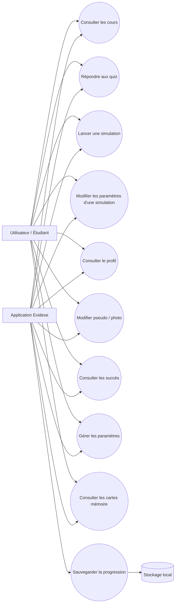
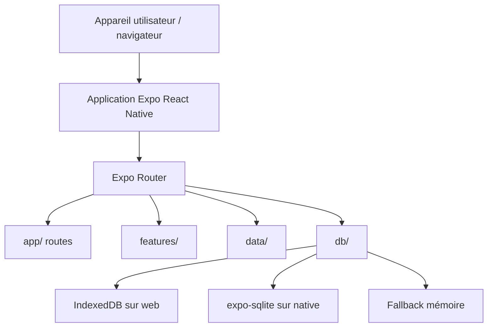
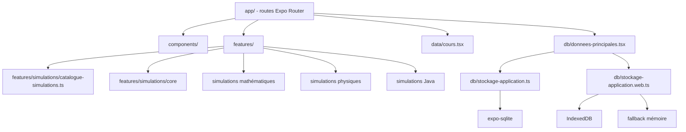
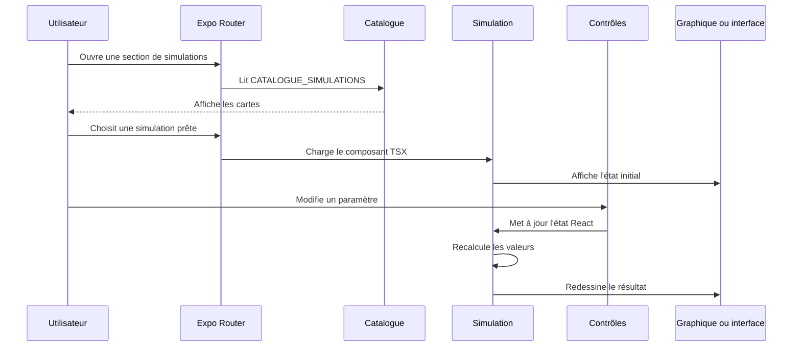
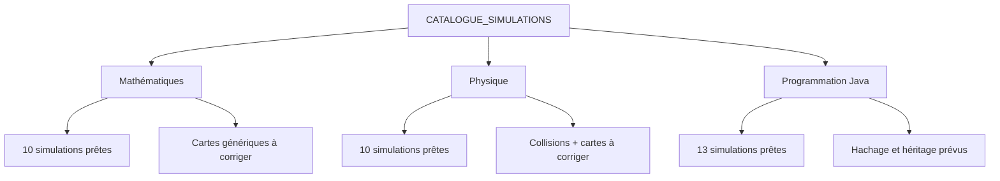
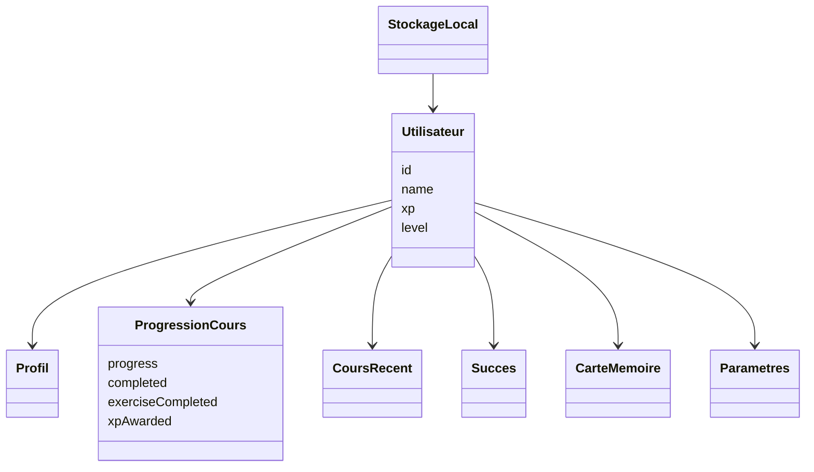

# Evidexe - Rapport complet d'analyse avec UML

Projet final - Programmation  
Tony Khabbaz & Aris Hadjeb

## Table des matières

- I. L’auteur
- II. Cahier des charges
- III. Cas d’utilisation principal
- IV. Architecture
- V. Organisation du projet
- VI. Détaillons les fonctionnalités
- VII. Description d’une interface homme-machine
- VIII. Traitement des données locales
- IX. Description des contenus pédagogiques
- X. Conception
- XI. Difficultés rencontrées
- XII. Limites et améliorations possibles
- XIII. Conclusion
- XIV. Annexes

## I. L’auteur

Tony Khabbaz et Aris Hadjeb

## II. Cahier des charges

### II-A. Préambule

Evidexe part d’un besoin simple: aider les étudiants à réviser des notions abstraites en mathématiques, en physique et en programmation Java. L’application regroupe des cours courts, des quiz, des simulations interactives et un suivi de progression.

### II-B. Le besoin

Des notions comme les dérivées, les intégrales, les forces, les champs, les circuits, les algorithmes et les structures de données sont difficiles à comprendre uniquement avec du texte. Evidexe répond à ce besoin en regroupant des cours organisés par matière, des quiz, des simulations interactives, un suivi de progression, un profil utilisateur et des paramètres.

#### II-B-1. Architecture générale

L’application est construite avec Expo, React Native, TypeScript et Expo Router. Le dossier `app/` contient les routes, `components/` les éléments d’interface réutilisables, `features/` les écrans et logiques spécialisés, `data/` les cours et quiz, `db/` les données locales et `features/simulations/` le catalogue ainsi que les composants de simulation.

#### II-B-2. Principe de fonctionnement

1. L’utilisateur ouvre Evidexe.
2. L’écran d’introduction mène vers l’accueil.
3. L’utilisateur choisit les cours, simulations, profil, succès ou paramètres.
4. Les cours contiennent des diapositives et un quiz final.
5. Les simulations permettent de manipuler des paramètres.
6. La progression est sauvegardée localement.
7. Le profil montre XP, niveau, cours terminés, cours récents, succès, cartes mémoire et personnalisation.

#### II-B-3. Contraintes

Evidexe doit fonctionner sur web et mobile. Le stockage local change selon la plateforme: IndexedDB sur web avec `stockage-application.web.ts`, `expo-sqlite` sur Android/native avec `stockage-application.ts`, et un fallback mémoire si IndexedDB n’est pas disponible. Le projet n’utilise pas de backend distant. Les cartes de simulation prévues ou incomplètes ne doivent pas être présentées comme terminées.

#### II-B-4. Objectifs du projet

- créer une application Expo utilisable sur web et mobile;
- organiser le contenu en mathématiques, physique et Java;
- proposer des cours courts avec diapositives et quiz;
- créer un catalogue de simulations interactives;
- sauvegarder la progression localement;
- gérer un profil avec XP, niveau, succès, cartes mémoire et paramètres;
- conserver une structure claire pour ajouter du contenu plus tard.

## III. Cas d’utilisation principal

### III-A. Préambule

Cette section donne une vue synthétique des interactions entre l’utilisateur, l’application et la couche de stockage local.

### III-B. Use case principal

#### III-B-1. Diagramme du cas d’utilisation



Figure 1 — Cas d’utilisation principal d’Evidexe.

Le diagramme résume les fonctions visibles par l’utilisateur. Le stockage local n’est pas un utilisateur humain, mais il intervient dans les actions qui doivent persister entre deux ouvertures de l’application.

#### III-B-2. Description des acteurs

| Acteur | Rôle |
| --- | --- |
| Utilisateur / Étudiant | Consulte les cours, réalise les quiz, lance les simulations et suit sa progression. |
| Stockage local | Conserve les données de progression, le profil, les paramètres et les informations liées à l’utilisateur actif. |
| Application Evidexe | Présente les contenus, calcule les résultats des simulations, met à jour l’interface et la progression. |

#### III-B-3. Description des cas d’utilisation

| Cas d’utilisation | Description |
| --- | --- |
| Consulter un cours | L’utilisateur choisit une matière, ouvre un cours et lit les diapositives. |
| Répondre à un quiz | L’utilisateur répond au quiz final associé à un cours. |
| Lancer une simulation | L’utilisateur choisit une simulation disponible dans le catalogue. |
| Modifier un paramètre de simulation | L’utilisateur agit sur un contrôle et observe le recalcul du résultat. |
| Sauvegarder la progression | L’application enregistre localement l’avancement, les cours récents et les complétions. |
| Consulter le profil | L’utilisateur voit son niveau, son XP, ses cours récents, ses succès et ses cartes mémoire. |
| Personnaliser le profil | L’utilisateur modifie le pseudo ou la photo de profil. |
| Modifier les paramètres | L’utilisateur règle notamment le mode sombre et le compteur FPS. |
| Consulter les succès | L’utilisateur consulte les objectifs atteints et la progression des succès. |
| Utiliser les cartes mémoire | L’utilisateur consulte, ajoute, renomme ou supprime des cartes mémoire locales. |

### III-C. Parcours utilisateur global

Un diagramme de parcours ne suffit pas à expliquer une application: il doit être accompagné d’un texte qui précise les choix, les limites et les cas particuliers. Ici, le flux montre le chemin principal depuis l’introduction jusqu’aux cours, simulations et données de profil.

```mermaid
flowchart TD
  U[Utilisateur] --> Intro[app/index.tsx - écran d'introduction]
  Intro --> Accueil[/(tabs)/accueil]
  Accueil --> Cours[/(tabs)/cours]
  Accueil --> Simulations[/(tabs)/simulations]
  Accueil --> Profil[/(tabs)/profil]
  Accueil --> Succes[/(tabs)/succes]
  Cours --> ChoixMatiere[Choix d'une matière]
  ChoixMatiere --> LectureCours[Lecture des diapositives]
  LectureCours --> QuizFinal[Quiz final]
  QuizFinal --> Progression[enregistrerProgressionCours]
  Progression --> Profil
  Simulations --> IndexMath[/(tabs)/mathematiques]
  Simulations --> IndexPhysique[/(tabs)/physique]
  Simulations --> IndexJava[/(tabs)/programmation-java]
  IndexMath --> SimulationMath[Simulation math prête]
  IndexPhysique --> SimulationPhysique[Simulation physique prête]
  IndexJava --> SimulationJava[Simulation Java prête]
  SimulationMath --> Controles[Contrôles]
  SimulationPhysique --> Controles
  SimulationJava --> Controles
  Controles --> Recalcul[État React et recalcul]
  Recalcul --> Rendu[Graphique ou interface]
  Profil --> Parametres[Paramètres]
  Profil --> CartesMemoire[Cartes mémoire]
  Profil --> ProgressionProfil[Cours récents et complétions]
  Profil --> Niveau[Niveau et XP]
  Parametres --> ModeSombre[Mode sombre]
  Personnalisation --> PseudoPhoto[Pseudo et photo]
```

Figure 1 bis — Parcours utilisateur global d’Evidexe.

Le parcours confirme que les cours et les simulations ne sont pas isolés: ils alimentent le profil, les données locales et les indicateurs de progression.

### III-D. Risques et points importants

- garder le rapport aligné avec le code réel;
- ne pas présenter les simulations prévues comme terminées;
- gérer la complexité du stockage local selon la plateforme;
- maintenir la compatibilité web/mobile;
- garder une interface cohérente malgré le nombre de cours et simulations;
- éviter l’attribution multiple d’XP;
- considérer un cours comme terminé seulement après le quiz final.

## IV. Architecture

### IV-A. Préambule

L’architecture est importante parce qu’Evidexe combine navigation, contenus pédagogiques, simulations, persistance locale et interface responsive.

### IV-B. Technologies utilisées

| Technologie | Rôle dans le projet |
| --- | --- |
| React Native | Interface multiplateforme de l’application. |
| Expo | Environnement de développement et d’exécution web/mobile. |
| Expo Router | Navigation par fichiers dans le dossier `app/`. |
| TypeScript / TSX | Typage et structure des écrans, composants et données. |
| React Native SVG | Graphiques et visualisations dans plusieurs simulations. |
| KaTeX / rendu de formules | Affichage de formules mathématiques dans certaines simulations. |
| IndexedDB | Stockage persistant côté web via `stockage-application.web.ts`. |
| expo-sqlite | Stockage persistant côté Android/native via `stockage-application.ts`. |
| Node.js / npm | Installation des dépendances et scripts du projet. |
| WebStorm | Environnement de développement utilisé pour le projet. |

### IV-C. Diagramme de déploiement / architecture technique



Figure 2 — Architecture technique simplifiée d’Evidexe.

Cette vue montre que le reste de l’application dépend d’une abstraction de stockage, et non directement d’IndexedDB ou de SQLite.

### IV-D. Architecture logique du code



Figure 2 bis — Architecture logique du code.

### IV-E. Épilogue

Cette architecture sépare les routes, les composants d’interface, les contenus pédagogiques, la logique des simulations et la gestion des données locales. Cette séparation facilite l’ajout futur de cours et de simulations.

## V. Organisation du projet

### V-A. Préambule

Le projet couvre trois domaines: mathématiques, physique et programmation Java. Cette diversité oblige à structurer les tâches, les fichiers et les responsabilités logiques.

### V-B. Échéancier du projet

| Période | Travail prévu | Travail réalisé | Commentaire |
| --- | --- | --- | --- |
| Semaine 1 | Définir le sujet | Choix d’une application éducative sur les mathématiques, la physique et Java. | Le périmètre initial est pédagogique et interactif. |
| Semaine 2 | Créer le projet | Mise en place avec Expo, React Native et TypeScript. | Base technique créée. |
| Semaine 3 | Faire la navigation | Ajout de l’intro, de l’accueil, des sections et du profil. | Navigation fondée sur Expo Router. |
| Semaine 4 | Ajouter les cours | Création des cours, diapositives et quiz dans `data/cours.tsx`. | Les contenus sont centralisés par matière. |
| Semaine 5 | Gérer la progression | Ajout du profil actif, d’utilisateurs locaux, des cours récents, de l’XP, des niveaux et des succès. | La logique de complétion devient plus stricte. |
| Semaine 6 | Ajouter des simulations de mathématiques | Dérivées, intégrales, limites, Taylor, Fourier, champs, séries et statistiques. | Simulations disponibles dans le catalogue. |
| Semaine 7 | Ajouter des simulations de physique | Gravité, pendule, projectile, ressort, mouvement circulaire, champs, optique, orbites et frottement. | Une entrée collisions reste prévue. |
| Semaine 8 | Ajouter les simulations Java | Tris, structures de données, chaînes, mémoire et multithreading. | Hachage et héritage restent prévus. |
| Semaine 9 | Stabiliser l’interface | Ajustements visuels, profil, paramètres, responsive et catalogue. | Travail de cohérence entre modules. |
| Semaine 10 | Préparer la remise | Mise à jour du rapport, vérification des diagrammes et distinction entre prêt et bientôt. | Le rapport doit rester aligné avec le code. |

### V-C. Description des tâches du projet

| Tâche | Description | Fichiers / zones concernées |
| --- | --- | --- |
| Mise en place du projet | Créer la base Expo / React Native / TypeScript. | `package.json`, `app.json`, configuration Expo |
| Navigation | Organiser l’introduction, l’accueil, les onglets, les cours, les simulations et le profil. | `app/` |
| Cours et quiz | Définir les cours, diapositives et quiz finaux. | `data/cours.tsx`, `features/cours/` |
| Simulations mathématiques | Créer les simulations de calcul, analyse et statistiques. | `features/simulations/mathematiques/` |
| Simulations physiques | Créer les simulations de mécanique, champs, optique et frottement. | `features/simulations/physique/` |
| Simulations Java | Créer les simulations de tris, structures de données et notions Java. | `features/simulations/programmation-java/` |
| Profil et progression | Afficher XP, niveau, cours récents, cours terminés, succès et cartes mémoire. | `app/(tabs)/profil/`, `components/profil/` |
| Sauvegarde locale | Persister les données utilisateur sur web et native. | `db/donnees-principales.tsx`, `db/stockage-application*.ts` |
| Paramètres | Gérer le mode sombre, le compteur FPS et la personnalisation. | `components/accueil/PanneauParametres.tsx`, profil |
| Stabilisation visuelle | Rendre les modules lisibles sur web et mobile. | `components/`, écrans de sections |
| Rapport et UML | Structurer le document, les scénarios et les diagrammes. | `RAPPORT_COMPLET_EVIDEXE.md` |

### V-D. Répartition logique du travail

Le rapport et le code disponibles ne donnent pas une répartition nominative fiable entre Tony Khabbaz et Aris Hadjeb. Il ne faut donc pas inventer de responsabilités individuelles. La répartition exacte dépend du travail effectué par l’équipe.

### V-E. Épilogue

L’organisation du projet permet de faire évoluer le contenu tout en conservant une base plus facile à maintenir.

## VI. Détaillons les fonctionnalités

### VI-A. Préambule

Cette section décrit les principaux modules fonctionnels de l’application.

### VI-B. Module des cours

#### VI-B-1. Fonctionnalité

Les cours sont définis dans `data/cours.tsx`. Le code contient 20 cours de mathématiques, 15 cours de physique et 15 cours de Java, pour un total de 50 cours. Chaque cours contient des diapositives et un quiz final. La théorie peut faire monter la progression jusqu’à 99 %, mais le vrai 100 % nécessite le quiz ou exercice final.

#### VI-B-2. Scénario: suivre un cours

| Code | Étape | Commentaire |
| --- | --- | --- |
| 1 | Choix de la matière | L’utilisateur choisit mathématiques, physique ou Java. |
| 2 | Choix du cours | L’utilisateur sélectionne un cours dans la liste. |
| 3 | Lecture des diapositives | L’application affiche le contenu progressivement. |
| 4 | Progression partielle | La progression augmente mais reste sous 100 % avant le quiz final. |
| 5 | Quiz final | L’utilisateur répond aux questions finales. |
| 6 | Sauvegarde | Progression, XP, cours récent et complétion sont enregistrés. |
| 7 | Profil mis à jour | Le profil affiche le niveau et l’avancement mis à jour. |

### VI-C. Module des simulations

#### VI-C-1. Fonctionnalité

Le catalogue des simulations se trouve dans `features/simulations/catalogue-simulations.ts`. Le rapport distingue les simulations prêtes des entrées prévues ou à corriger.

#### VI-C-2. Simulations prêtes

| Simulation mathématique | État | Rôle |
| --- | --- | --- |
| Dérivées | Disponible | Tangente, point choisi, valeur de la fonction et pente locale. |
| Intégrales | Disponible | Sommes de Riemann, aire approchée, aire exacte et erreur. |
| Série de Taylor | Disponible | Approximation par développement local et erreur. |
| Limites | Disponible | Approche à gauche et à droite d’une valeur. |
| Fourier | Disponible | Signal reconstruit par harmoniques et phaseurs. |
| Champ de pentes | Disponible | Champ directionnel et courbe solution. |
| Champ vectoriel | Disponible | Vecteurs, norme, divergence, rotation et particules. |
| Séries | Disponible | Termes et sommes partielles. |
| Loi normale standard | Disponible | Probabilité entre deux bornes. |
| Loi de Student | Disponible | Degrés de liberté, valeur critique et intervalle central. |

| Simulation physique | État | Rôle |
| --- | --- | --- |
| Gravité | Disponible | Force gravitationnelle selon masses et distance. |
| Pendule | Disponible | Oscillation, période, longueur, gravité et amortissement. |
| Mouvement projectile | Disponible | Trajectoire et statistiques du lancer. |
| Ressort et loi de Hooke | Disponible | Oscillation, constante de rappel, masse et amortissement. |
| Mouvement circulaire | Disponible | Vitesse, période, accélération et force centripète. |
| Champs magnétiques | Disponible | Fils, courant, lignes de champ et point d’observation. |
| Champs électriques | Disponible | Configurations de charges et champ résultant. |
| Optique et réfraction | Disponible | Réflexion, réfraction et angle critique. |
| Mécanique orbitale | Disponible | Orbite, périhélie, aphélie et statistiques orbitales. |
| Frottement | Disponible | Force nette, état du bloc et accélération. |

| Simulation Java | État | Rôle |
| --- | --- | --- |
| Tri à bulles | Disponible | Comparaisons et échanges successifs. |
| Tri par sélection | Disponible | Sélection du minimum restant. |
| Tri par insertion | Disponible | Insertion progressive dans une partie ordonnée. |
| Tri fusion | Disponible | Découpage, tri des sous-tableaux et fusion. |
| Tri rapide | Disponible | Pivot et partitionnement. |
| Pile | Disponible | Opérations `push`, `pop`, `peek` et principe LIFO. |
| File | Disponible | Opérations `offer`, `poll`, `peek` et principe FIFO. |
| Liste chaînée | Disponible | Noeuds, liens, insertions et suppressions. |
| ArrayList | Disponible | Taille dynamique, capacité et redimensionnement. |
| Tableaux | Disponible | Index, cases fixes et accès direct. |
| Chaînes et caractères | Disponible | Index, caractères, sous-chaînes et longueur. |
| Mémoire | Disponible | Types, bits, adresses et représentation mémoire. |
| Multithreading | Disponible | Threads, synchronisation et comportements concurrents. |

#### VI-C-3. Simulations prévues ou à corriger

| Élément | État | Commentaire |
| --- | --- | --- |
| Collisions élastiques | Bientôt | Route présente, mais elle charge l’écran générique `EcranSimulationLigne`. |
| Collisions de hachage | Bientôt | Route présente, mais elle charge l’écran générique `EcranSimulationLigne`. |
| Héritage | Bientôt | Route présente, mais elle charge l’écran générique `EcranSimulationLigne`. |
| Cartes génériques “Bientôt” en mathématiques | À corriger | Elles sont générées avec `statut: "pret"`, mais pointent vers des routes absentes. |
| Cartes génériques “Bientôt” en physique | À corriger | Elles sont générées avec `statut: "pret"`, mais pointent vers des routes absentes. |

#### VI-C-4. Flux commun d’une simulation



Figure 3 — Flux commun d’une simulation interactive.

### VI-D. Module du profil et de la progression

Le profil utilise l’utilisateur actif. Il affiche XP, niveau, cours récents, cours complétés, succès, cartes mémoire, pseudo, photo de profil, mode sombre et compteur FPS. Les données sont locales et ne sont pas synchronisées avec un backend.

### VI-E. Module des paramètres

Les paramètres visibles concernent surtout le mode sombre, le compteur FPS et la personnalisation du profil. Le fichier de données prévoit aussi une langue et des notifications, mais le rapport ne doit pas présenter un système complet de notifications distantes.

## VII. Description d’une interface homme-machine

### VII-A. Préambule

Cette section décrit les écrans principaux, comme dans un document d’analyse qui relie les fonctions aux interfaces.

### VII-B. Interface d’accueil

L’application commence par un écran d’introduction puis mène vers l’accueil. L’accueil donne accès aux cours, aux simulations, au profil, aux succès et aux paramètres.

### VII-C. Interface des cours

L’interface des cours propose le choix de la matière, une liste de cours, une vue par diapositives, un quiz final et un affichage de la progression.

### VII-D. Interface des simulations

L’interface des simulations présente des cartes. Les cartes disponibles ouvrent des routes fonctionnelles. Les cartes “bientôt” ou génériques doivent rester clairement séparées des simulations terminées. Les simulations utilisent des contrôles comme sliders, boutons, champs, sélecteurs et affichages graphiques.

### VII-E. Interface du profil

Le profil regroupe le niveau, l’XP, les cours récents, les cours terminés, les succès, les cartes mémoire et la personnalisation.

### VII-F. Cinématique d’une simulation

| Code | Étape | Commentaire |
| --- | --- | --- |
| 1 | Ouvrir le catalogue | L’utilisateur accède aux simulations depuis l’accueil. |
| 2 | Choisir une catégorie | Mathématiques, physique ou programmation Java. |
| 3 | Sélectionner une simulation prête | La carte mène vers une route Expo Router existante. |
| 4 | Affichage initial | Le composant TSX affiche l’état de départ. |
| 5 | Modifier un paramètre | L’utilisateur agit sur un slider, bouton, champ ou sélecteur. |
| 6 | Mise à jour d’état | React met à jour les valeurs locales du composant. |
| 7 | Recalcul | La simulation recalcule les valeurs théoriques ou visuelles. |
| 8 | Redessin | Le graphique SVG ou l’interface visuelle est rafraîchi. |
| 9 | Navigation | L’utilisateur peut revenir, retourner à l’accueil ou ouvrir le profil. |

### VII-G. Contrôles

Les simulations utilisent des sliders, boutons, sélecteurs de choix, champs numériques et toggles. Ces contrôles doivent rester lisibles sur web et mobile.

## VIII. Traitement des données locales

### VIII-A. Préambule

Evidexe n’a pas de traitement batch mensuel. Le traitement important est la sauvegarde locale et la mise à jour de la progression.

### VIII-B. Sauvegarde de la progression

La sauvegarde concerne l’utilisateur actif, les cours complétés, les cours récents, l’XP, les niveaux, les succès et les paramètres. La logique passe par `donnees-principales.tsx` et par l’abstraction `stockage-application`.

### VIII-C. Web vs native

| Plateforme | Technologie | Rôle |
| --- | --- | --- |
| Web | IndexedDB | Stockage local persistant dans un magasin clé-valeur. |
| Android/native | expo-sqlite | Stockage local persistant avec une table `kv`. |
| Fallback | Stockage mémoire | Stockage temporaire si IndexedDB est indisponible. |

### VIII-D. Reprise en cas d’erreur

Les cas à prévoir sont IndexedDB indisponible, données introuvables, utilisateur actif absent ou route de simulation manquante. Le comportement attendu est d’utiliser un fallback mémoire, de recréer un profil par défaut, d’éviter les crashs et d’afficher un écran prévu ou simplifié pour une simulation indisponible.

## IX. Description des contenus pédagogiques

### IX-A. Préambule

Evidexe regroupe trois domaines d’apprentissage.

### IX-B. Mathématiques

Le contenu couvre fonctions, limites, dérivées, intégrales, sommes de Riemann, séries de Taylor, champs vectoriels, champs de pentes, lois normale et de Student, probabilités, inférence et mathématiques discrètes.

### IX-C. Physique

Le contenu couvre vecteurs, position, vitesse, accélération, MRUA, chute libre, projectiles, mouvement circulaire, lois de Newton, force nette, frottement, travail, énergie, puissance, quantité de mouvement, gravité, pendule, ressort, orbites, champs électriques, champs magnétiques, optique et circuits.

### IX-D. Programmation Java

Le contenu couvre variables, types, transtypage, opérateurs, conditions, boucles, tableaux, chaînes, méthodes, classes, objets, algorithmes de tri, pile, file, liste chaînée, ArrayList, mémoire et multithreading. Les collisions de hachage et l’héritage sont prévus.

## X. Conception

### X-A. Préambule

Cette section résume les choix de conception du projet.

### X-B. Découpage en packages / dossiers

| Dossier | Rôle |
| --- | --- |
| `app/` | Routes Expo Router: introduction, accueil, cours, simulations, profil et succès. |
| `components/` | Composants réutilisables: interface, profil, panneaux, thème et logo. |
| `features/` | Écrans et logiques spécialisées des cours, sections et simulations. |
| `features/simulations/` | Catalogue, écrans de sections et simulations par domaine. |
| `features/simulations/core` | Éléments communs: entête, rendu de formules, infobulles et utilitaires d’animation. |
| `data/` | Cours, diapositives et quiz. |
| `db/` | Modèle local, progression, utilisateurs, succès, paramètres et stockage plateforme. |
| `assets/` | Images, logo et icônes de l’application. |

### X-C. Catalogue des simulations



Figure 4 — Organisation du catalogue des simulations.

### X-D. Modèle de progression



Figure 5 — Modèle simplifié de progression locale.

### X-E. Règles importantes

- Un cours est vraiment complété seulement après le quiz final.
- L’XP doit être attribuée une seule fois par complétion.
- Les simulations marquées “bientôt” ne sont pas comptées comme terminées.
- Le stockage local doit fonctionner sur web et native.
- L’interface doit rester cohérente entre les modules.
- Toutes les affirmations du rapport doivent correspondre au code réel.

## XI. Difficultés rencontrées

- organiser un projet couvrant trois domaines;
- gérer une progression plus complexe que prévu;
- adapter le stockage web et mobile;
- éviter les affirmations incorrectes dans le rapport;
- distinguer les simulations prêtes et prévues;
- garder une interface cohérente;
- tester un grand nombre de simulations.

## XII. Limites et améliorations possibles

- ajouter un backend ou une synchronisation de compte plus tard;
- terminer les routes de simulations prévues;
- corriger les cartes génériques “Bientôt” marquées comme prêtes;
- ajouter plus d’options d’accessibilité;
- ajouter des statistiques d’usage plus détaillées;
- ajouter plus d’exercices par cours;
- améliorer la couverture de tests;
- améliorer les diagrammes et captures générées;
- rendre les formules des simulations plus faciles à valider.

## XIII. Conclusion

Evidexe atteint son objectif principal: proposer un support d’apprentissage interactif qui combine cours, quiz, simulations, profil, progression et persistance locale. L’application ne remplace pas un cours complet, mais elle aide à réviser et à visualiser des notions abstraites.

L’architecture actuelle permet de faire évoluer le projet. Les ajouts futurs devraient surtout compléter les simulations prévues, corriger les entrées de catalogue ambiguës et renforcer les tests.

## XIV. Annexes

### Annexe A — Liste complète des simulations

Les simulations prêtes sont celles listées en VI-C-2. Les simulations prévues ou à corriger sont listées en VI-C-3.

#### Annexe A-1 — Options des simulations mathématiques

| Simulation | Options principales | Résultat |
| --- | --- | --- |
| Dérivées | Choisir une fonction et modifier `x0` | Affiche le point, la tangente, `f(x0)` et `f’(x0)`. |
| Intégrales | Choisir une fonction, une méthode et le nombre de rectangles | Compare l’aire approchée, l’aire exacte et l’erreur. |
| Série de Taylor | Choisir une fonction et le nombre de termes | Montre l’approximation et l’erreur. |
| Limites | Choisir une fonction et la distance d’approche | Affiche les valeurs à gauche et à droite. |
| Fourier | Choisir un signal et le nombre d’harmoniques | Affiche l’onde approximée et les phaseurs. |
| Champ de pentes | Choisir une équation différentielle et des conditions | Affiche le champ et une courbe solution. |
| Champ vectoriel | Choisir un champ et activer les particules | Affiche vecteurs, divergence, rotation et mouvement. |
| Séries | Choisir une série et le nombre de termes | Affiche les termes et les sommes partielles. |
| Loi normale standard | Modifier moyenne, écart-type et bornes | Calcule une probabilité sur la courbe normale. |
| Loi de Student | Modifier degrés de liberté et alpha | Affiche valeur critique et intervalle central. |

#### Annexe A-2 — Options des simulations physiques

| Simulation | Options principales | Résultat |
| --- | --- | --- |
| Gravité | Modifier les masses et la distance | Calcule la force gravitationnelle. |
| Pendule | Modifier longueur, gravité, amortissement et angle | Anime le pendule et calcule la période. |
| Mouvement projectile | Modifier vitesse, angle et gravité | Affiche la trajectoire et les statistiques. |
| Ressort et loi de Hooke | Modifier `k`, masse, amplitude et amortissement | Affiche l’oscillation et la phase. |
| Mouvement circulaire | Modifier rayon, vitesse angulaire et masse | Calcule vitesse, période, accélération et force centripète. |
| Champs magnétiques | Modifier fils, courant, affichage du champ et point d’observation | Affiche vecteurs, lignes de champ et intensité. |
| Champs électriques | Choisir une configuration de charges | Affiche le champ résultant et les lignes. |
| Optique et réfraction | Modifier indices et angle incident | Calcule réflexion, réfraction et angle critique. |
| Mécanique orbitale | Modifier masse, excentricité, orientation et vitesse orbitale | Affiche orbite, périhélie, aphélie et statistiques orbitales. |
| Frottement | Modifier masse, force appliquée et coefficients | Calcule force nette, état du bloc et accélération. |

#### Annexe A-3 — Options des simulations Java

| Simulation | Options principales | Résultat |
| --- | --- | --- |
| Tris | Mélanger un tableau et avancer étape par étape | Visualise comparaisons, échanges, pivots ou fusions. |
| Pile | Utiliser `push`, `pop` et `peek` | Montre le sommet et le principe LIFO. |
| File | Utiliser `offer`, `poll` et `peek` | Montre l’avant, l’arrière et le principe FIFO. |
| Liste chaînée | Ajouter, retirer ou parcourir des noeuds | Montre les liens et les changements de pointeurs. |
| ArrayList | Modifier taille et opérations | Montre capacité, occupation et redimensionnement. |
| Tableaux | Choisir index et opérations | Montre accès direct, cases et décalages. |
| Chaînes et caractères | Modifier texte et index | Montre caractères, sous-chaînes et longueur. |
| Mémoire | Manipuler des valeurs et observer leur représentation | Montre des idées liées aux types, bits et mémoire. |
| Multithreading | Modifier threads, itérations et synchronisation | Compare une exécution synchronisée et une situation à risque. |

### Annexe B — Liste des fichiers importants

| Partie | Fichiers importants | Rôle |
| --- | --- | --- |
| Routes | `app/` | Contient les écrans et les chemins Expo Router. |
| Cours | `data/cours.tsx`, `features/cours/ecran-cours.tsx` | Stocke les cours, diapositives, quiz et affichage. |
| Simulations | `features/simulations/` | Contient catalogue, noyau commun et simulations par matière. |
| Profil | `app/(tabs)/profil`, `components/profil`, `components/accueil` | Affiche progression, paramètres, succès, cartes mémoire, pseudo et photo. |
| Stockage | `db/donnees-principales.tsx`, `db/stockage-application.ts`, `db/stockage-application.web.ts` | Gère utilisateurs locaux, cours, XP, succès et paramètres. |
| Thème | `constantes/theme.ts`, `hooks/use-schema-couleur.ts` | Gère l’apparence claire/sombre. |

Fonctions et composants importants:

- `donneesLocales.enregistrerProgressionCours`: sauvegarde la progression d’un cours.
- `donneesLocales.obtenirCoursRecents`: récupère les cours récemment ouverts.
- `donneesLocales.enregistrerClicSimulation`: garde une trace des simulations ouvertes.
- `obtenirQuizCours`: récupère le quiz d’un cours.
- `EcranIndexSection`: affiche les cartes de simulation selon la section.
- `EnteteEcranSimulation`: fournit un entête commun aux simulations.
- `utiliserIntervalleSimulation`: aide certaines animations à se mettre à jour régulièrement.

### Annexe C — Diagrammes UML

Les diagrammes utilisés dans le rapport couvrent le cas d’utilisation principal, le parcours utilisateur, l’architecture technique, l’architecture logique, le flux d’une simulation, le catalogue des simulations et le modèle de progression.

### Annexe D — Notes sur les fonctionnalités prévues

Les collisions élastiques, les collisions de hachage et l’héritage doivent rester présentés comme prévus. Les cartes génériques “Bientôt” de mathématiques et de physique doivent être corrigées, car elles sont générées comme disponibles tout en pointant vers des routes absentes.
